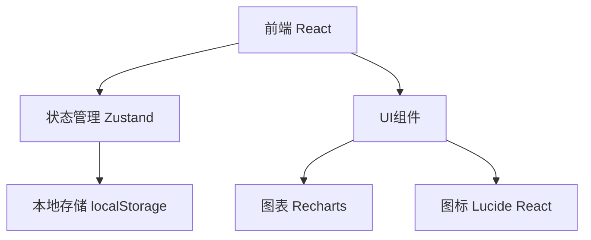
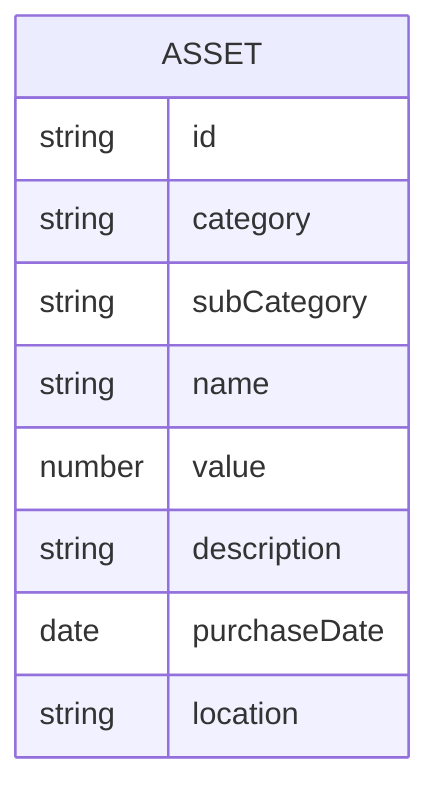

## 1. 架构设计

## 2. 技术描述

* 前端：React\@18 + TypeScript + TailwindCSS\@3 + Vite

* 初始化工具：vite-init

* 后端：无（纯前端应用，使用本地存储）

* 数据库：localStorage（浏览器本地存储）

## 3. 路由定义

| 路由                    | 用途      |
| --------------------- | ------- |
| /                     | 首页，资产总览 |
| /assets/:category     | 资产分类页面  |
| /assets/:category/add | 添加资产    |
| /assets/:category/:id | 资产详情    |

## 4. API定义

无后端API，使用本地存储

## 5. 服务器架构图

无后端

## 6. 数据模型

### 6.1 数据模型定义

### 6.
