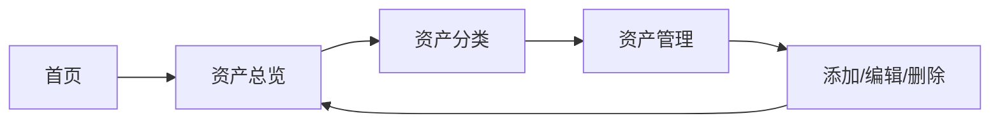

## 1. 产品概述
个人资产管理应用，帮助用户全面记录、分类和管理各类资产，提供资产概览和明细管理功能。

- 主要目的：让用户清晰了解自身资产状况，进行科学分类管理
- 目标用户：个人资产管理者、理财人士、需要资产管理需求的个人用户

## 2. 核心功能

### 2.1 用户角色
| 角色 | 注册方式 | 核心权限 |
|------|----------|----------|
| 普通用户 | 本地存储 | 浏览、添加、编辑、删除资产 |

### 2.2 功能模块
1. **首页**：资产总览、资产分布、快速添加
2. **资产分类页**：五大资产分类展示
3. **资产详情页**：资产详细信息管理
4. **资产列表页**：各类别资产列表

### 2.3 页面详情
| 页面名称 | 模块名称 | 功能描述 |
|----------|----------|----------|
| 首页 | 资产总览卡片 | 展示总资产、各类别资产占比、图表展示 |
| 首页 | 快速操作区 | 快速添加资产入口、最近添加按钮 |
| 资产分类页 | 分类导航 | 五大资产分类标签、点击切换 |
| 资产分类页 | 资产列表 | 该类别下的所有资产 |
| 资产详情页 | 资产编辑 | 添加、编辑、删除资产详情 |

## 3. 核心流程
用户进入应用 → 查看资产总览 → 选择资产分类 → 管理具体资产 → 添加/编辑/删除 → 返回总览

## 4. 用户界面设计

### 4.1 设计风格
- 主色调：深蓝色 (#0ea5e9（天空蓝）和 深灰 (#0f172a)
- 辅助色：绿色 (#10b981)、橙色 (#f97316)、紫色 (#8b5cf6)、粉色 (#ec4899)、青色 (#14b8a6)
- 按钮风格：圆角矩形、渐变色、悬停效果
- 字体：系统字体，清晰易读
- 布局风格：卡片式布局，侧栏导航
- 图标风格：Lucide React 图标库，简约现代

### 4.2 页面设计概述
| 页面名称 | 模块名称 | UI元素 |
|----------|----------|--------|
| 首页 | 资产总览卡片 | 大数字展示、饼图图表、渐变色背景 |
| 资产分类页 | 分类导航 | 标签页切换、不同颜色代表不同类别 |
| 资产管理页 | 资产卡片 | 列表式展示、快速操作按钮 |

### 4.3 响应式
桌面优先设计，同时适配平板和手机端。

### 4.4 3D场景指引
不适用
